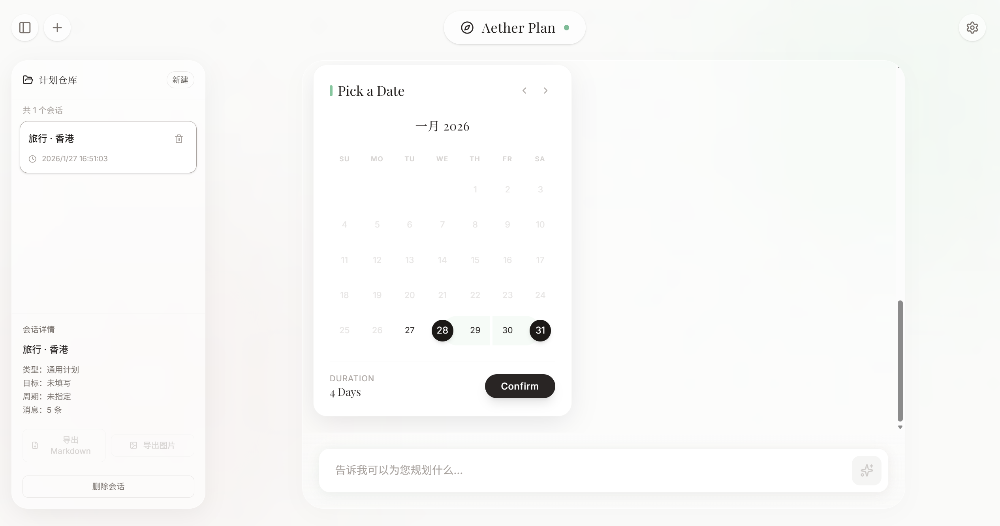
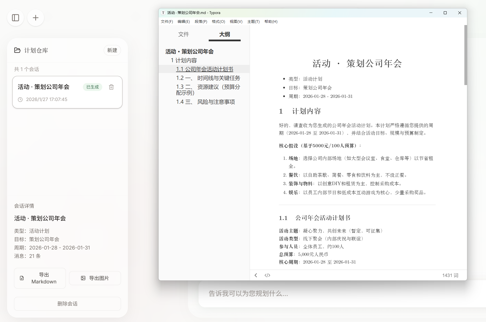

# 🌌 Aether Plan - AI Universal Planner

<div align="center">


[English](#english) | [中文](#chinese)

</div>

---

<a name="english"></a>
## 🇬🇧 English Introduction

**Aether Plan** is not just a travel assistant—it is your **AI-powered Universal Planner**. Whether you are coordinating a complex trip, organizing a large event, managing a team project, or setting personal life goals, Aether Plan provides intelligent, context-aware support.

### ✨ Plan Everything

Aether Plan understands different domains and adapts its assistance accordingly:

-   **🌍 Travel Planning**: Intelligent itinerary generation, real-time flight (Amadeus) & train (12306) search, hotel booking, and interactive map visualizations (Amap/Leaflet).
-   **🎓 Study Goals**: Design learning paths, track curriculum progress, and manage exam preparation schedules.
-   **💼 Project Management**: Breakdown requirements into milestones, define team roles, and track deliverables.
-   **📅 Event Organization**: Comprehensive checklists for venues, budgets, and timelines for events of any scale.
-   **🏠 Life & Habits**: Set personal goals, build daily routines, and track habit formation.

### 🎨 Key Features

-   **🤖 Context-Aware AI Chat**: Discuss your plans naturally. The AI understands intent and switches modes automatically.
-   **🗺️ Rich Interactive Widgets**:
    -   **Map View**: Visual exploration of POIs and routes.
    -   **Cards**: Detailed info for Hotels, Flights, and Attractions.
    -   **Timelines**: Visual Gantt-style charts for project/study plans.
-   **🛠️ Powerful Integrations**:
    -   **Amap (HighNavi)**: POI search, geocoding, and route planning.
    -   **12306**: Real-time train ticket queries.
    -   **Amadeus**: Global flight data.
-   **📝 Export & Share**: Generate Markdown reports or image snapshots of your plans.

### 📸 Visual Tour

| Intelligent Intent Detection | Date & Time Planning |
|:---:|:---:|
| <br>_Automatically identifies intent (Travel, Study, Life)_ | <br>_Intuitive calendar and timeframe selection_ |

| Flight Search & Smart Map | Hotel Search |
|:---:|:---:|
| <br>_Visualize routes and flight paths on the map_ | <br>_Find the perfect stay with rich filters_ |

| Hotel Details | Comprehensive Plan Output |
|:---:|:---:|
| <br>_View amenities, room types, and prices_ | <br>_Generate structured, exportable Markdown plans_ |

> *Note: While the screenshots highlight travel features, the underlying engine supports Study, Project, and Event planning with equal depth.*

### 🚀 Getting Started

1.  **Clone the repository**
    ```bash
    git clone https://github.com/NkAntony777/Aether-Plan.git
    cd Aether-Plan
    ```

2.  **Install dependencies**
    ```bash
    npm install
    ```

3.  **Run the development server**
    ```bash
    npm run dev
    ```

---

<a name="chinese"></a>
## 🇨🇳 中文介绍

**Aether Plan (天宫计划)** 不仅仅是一个旅行助手，它是您的 **AI 全能规划师**。无论您是计划一场复杂的跨国旅行、筹备大型活动、管理团队项目，还是设定个人生活目标，Aether Plan 都能提供智能、情境感知的全方位支持。

### ✨ 万物皆可规划

Aether Plan 深度理解不同领域的规划需求，并自动适配助手模式：

-   **🌍 旅行规划**: 智能生成行程单，实时查询航班 (Amadeus) 与高铁 (12306)，集成高德地图 (Amap) 实现沉浸式地点探索。
-   **🎓 学习成长**: 定制学习路线图，拆解考试复习计划，追踪学习进度。
-   **💼 项目管理**: 将复杂需求拆解为里程碑，定义团队角色，管理关键交付物。
-   **📅 活动筹备**: 为各类活动提供从场地筛选到预算管理的的全流程核对清单。
-   **🏠 生活目标**: 设定生活愿景，建立习惯追踪体系，管理每日行动清单。

### 🎨 核心特性

-   **🤖 上下文感知 AI**: 自然流畅的对话体验。AI 能自动识别您的意图并在不同规划模式间无缝切换。
-   **🗺️ 丰富的交互组件**:
    -   **地图视图**: 直观展示地点分布与路线规划。
    -   **多维卡片**: 酒店、航班、景点详情一目了然。
    -   **时间线**: 为项目和学习计划自动生成甘特图或阶段表。
-   **🛠️ 强力数据集成**:
    -   **高德地图**: 精准的 POI 搜索与地理编码。
    -   **12306**: 实时火车票余票查询。
    -   **Amadeus**: 全球航班数据覆盖。
-   **📝 导出与分享**: 一键生成 Markdown 报告或图片快照，分享您的完美计划。

### 📸 精彩预览

| 智能意图识别 | 日期与时间规划 |
|:---:|:---:|
| <br>_自动识别规划意图（旅行、学习、生活）_ | <br>_直观的日历与时间段选择_ |

| 航班查询与智能地图 | 酒店搜索 |
|:---:|:---:|
| <br>_在地图上可视化航线与路径_ | <br>_通过丰富筛选找到完美住宿_ |

| 酒店详情 | 全能计划输出 |
|:---:|:---:|
| <br>_查看设施、房型与实时价格_ | <br>_生成结构化、可导出的 Markdown 计划书_ |

> *注：虽然截图主要展示了旅行场景，但 Aether Plan 的核心引擎同样完美支持学习、项目和活动规划。*

### 🚀 快速开始

1.  **克隆仓库**
    ```bash
    git clone https://github.com/NkAntony777/Aether-Plan.git
    cd Aether-Plan
    ```

2.  **安装依赖**
    ```bash
    npm install
    ```

3.  **启动开发服务器**
    ```bash
    npm run dev
    ```

---

<div align="center">

Made with ❤️ by Aether Plan Team

</div>
